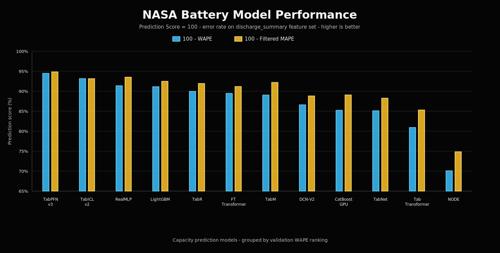

# Secondary Battery ML

NASA battery cycle-level capacity prediction experiments.



Active dataset:

```text
Kaggle: patrickfleith/nasa-battery-dataset
raw: data/nasa_battery_raw/cleaned_dataset
processed: data/processed/nasa_cycle_level.csv
```

Run one LightGBM baseline:

```powershell
.\.venv314\Scripts\python.exe train.py --model lightgbm --feature-set discharge_summary --full-data --valid-full-data
```

Local virtual environments, raw data, checkpoints, and experiment outputs are excluded from Git.
